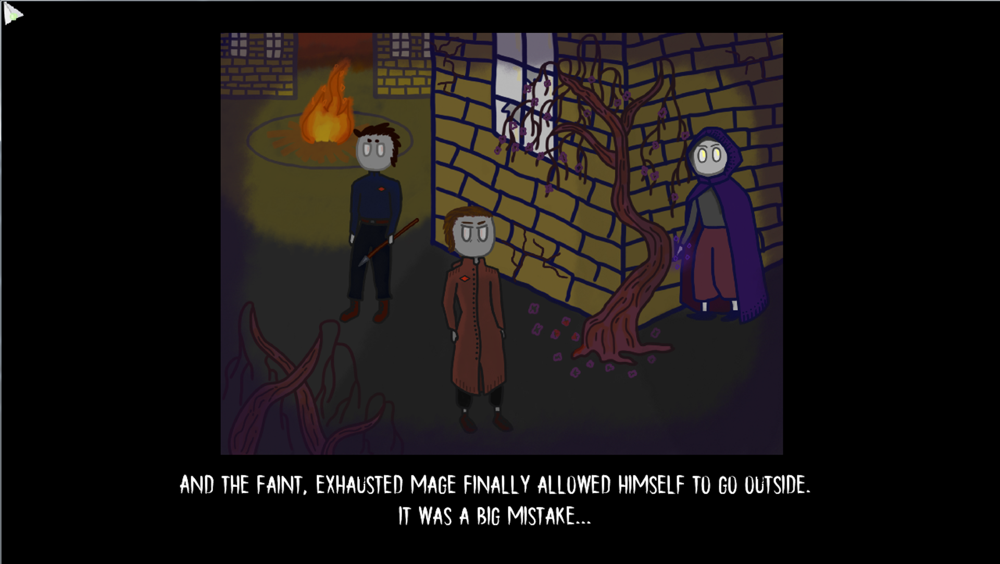
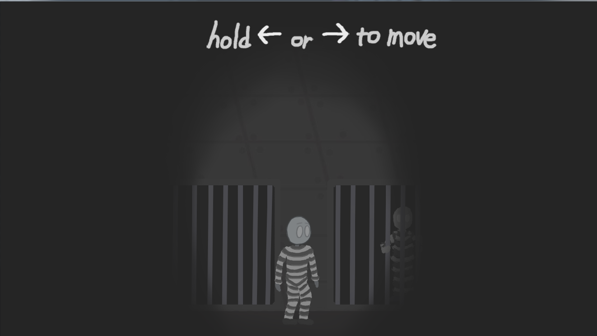

# The Cage of Mage
## Multi-level python-powered quest game
  
* * *  
Once upon a time, the world's last ochlocratic Kingdom was overtaken by the largest antimagic revolution. Dragons are murdered, witches are burnt, wizards and shamans are in the exile. But the only one mage survived - one of the most astute, savvy hereditary sorcerers - it is you. But the time is going and everyting is changing: you was detected and grabbed by royal guards. Now you are the last mage in the Kingdom but you are in the prison's cage. The mage in cage. The cage of mage...  
* * *  

* Interesting in realisation
* Interesting in playing
* Lots of different and exciting things to explore
* Some interesting plot  
* Different ways to pass levels  
* Beautiful simplified hand-drawn graphics
* Even more!

Screenshots:

